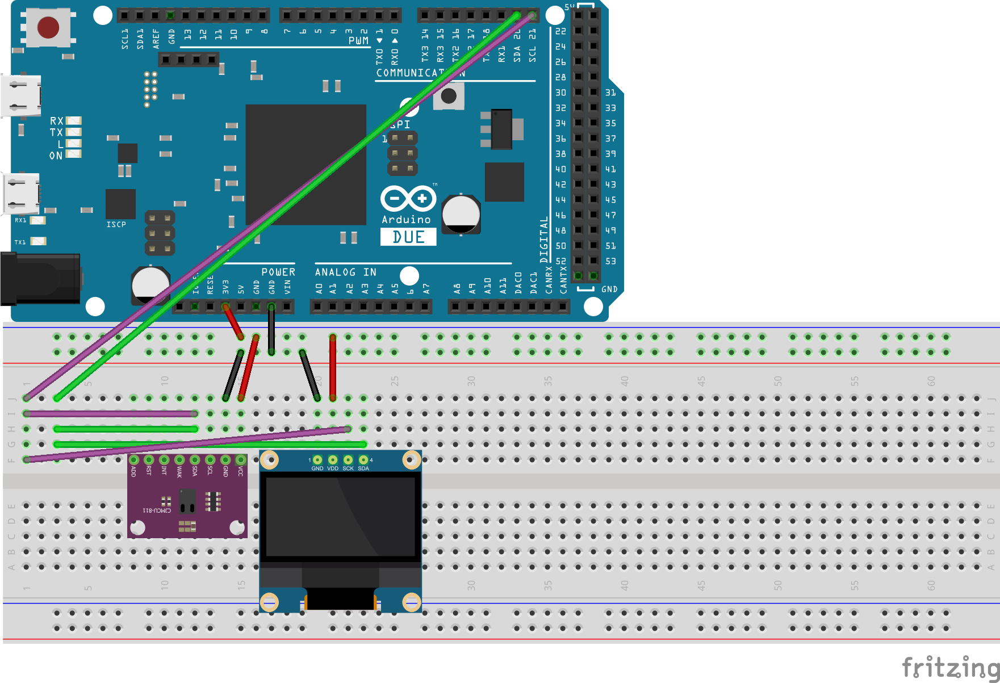

# IPASS-2023
---

This is my IPASS project for the last project of the first year HBO-ICT TI on the HU.  
I use the SI7021 to measure the temperature and humidity of the room, and display the result on a Oled screen.  

If you want to read the documentation, please go to [The github page](https://lfgaming.github.io/IPASS-2023/), or run the doxygen yourself.

The pins of my chips are connected as follows:

|CJMCU-8128| |Arduino| |SSD1306|
|---|---|---|---|---|
|VCC|<->|3V3|<->|VDD|
|GND|<->|GND|<->|GND|
|SDA|<->|SDA Pin 21|<->|SDA|
|SCL|<->|SCL Pin 22|<->|SCK|
|WAK|<->|GND

